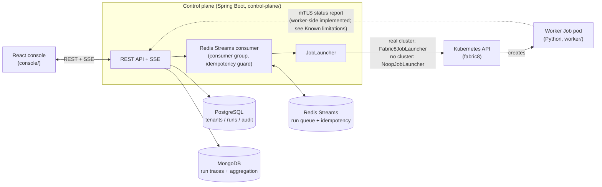

# AGENTPLANE

[](https://github.com/harsha-andra/agentplane/actions/workflows/ci.yml)
[](https://github.com/harsha-andra/agentplane/actions/workflows/cd.yml)


AGENTPLANE is a Kubernetes control plane for LLM agent workloads: it accepts a run request,
persists it, queues it onto Redis Streams, launches it as a Kubernetes `Job` (or simulates that
in-process with no cluster at all), tracks its lifecycle, streams live status/log events over
SSE, and exposes both an operational (Postgres) and an analytical (MongoDB aggregation) view over
the result - with a Python worker as the Job payload, a Helm chart (cert-manager mTLS,
default-deny NetworkPolicy, per-tenant namespace isolation) to run it on a real cluster, and
Terraform for the Azure infrastructure underneath.

## Architecture



## Quick start (works from a clean clone - no Kubernetes cluster needed)

```bash
git clone https://github.com/harsha-andra/agentplane
cd agentplane
make up          # == docker compose up --build
```

This starts Postgres, MongoDB, Redis, the control plane, and the console. The control plane runs
with `agentplane.k8s.enabled=false` (the default) - its `orchestration.NoopJobLauncher` simulates
a run's entire lifecycle (SCHEDULED → RUNNING → SUCCEEDED/FAILED) with in-process scheduled
callbacks instead of a real Kubernetes `Job`, so the whole system - API, persistence, streaming,
SSE, analytics - is fully explorable with **no cluster anywhere**.

- **API / Swagger UI:** http://localhost:8080/swagger-ui.html
- **Console:** http://localhost:5173
- **Actuator health:** http://localhost:8080/actuator/health
- **Prometheus metrics:** http://localhost:8080/actuator/prometheus

To also seed 5 tenants and ~80 runs (with traces) so there's something to look at immediately:

```bash
make seed        # == SPRING_PROFILES=local,seed docker compose up --build
```

Bring it down with `make down` (named volumes are kept - `docker compose down -v` to also wipe
them); tail logs with `make logs`.

## Endpoints

| Method | Path | Description |
|---|---|---|
| `GET`  | `/api/v1/runs` | Paginated, filterable (`status`, `tenantId`, `q`) list of runs |
| `GET`  | `/api/v1/runs/{id}` | Full run detail (spec, pod status, token usage, cost) |
| `POST` | `/api/v1/runs` | Submit a new run (`201`) |
| `POST` | `/api/v1/runs/{id}/cancel` | Cancel a run |
| `GET`  | `/api/v1/runs/{id}/events` | Live SSE stream of status transitions + log lines |
| `GET`  | `/api/v1/runs/{id}/traces` | Raw execution trace for a run (from MongoDB) |
| `GET`  | `/api/v1/tenants` | List tenants |
| `POST` | `/api/v1/tenants` | Create a tenant (`201`) - provisions its namespace/quota |
| `GET`  | `/api/v1/analytics/tool-latency?days=7` | Per-tool call volume, avg/p95 latency, error rate |
| `GET`  | `/api/v1/analytics/overview` | Dashboard overview (active/queued runs, success rate, etc.) |

Full request/response schemas: `/swagger-ui.html`. See `control-plane/README.md` for the complete
configuration table (every env var, matched exactly by `docker-compose.yml` and
`charts/agentplane/values.yaml`).

## Engineering highlights

- **Polyglot persistence with a real aggregation pipeline.** Postgres for tenants/runs/audit
  (transactions, joins, optimistic locking); MongoDB for the high-volume, schema-varying trace
  stream. Per-tool latency/error-rate stats are computed by an actual MongoDB
  `$match → $group → $project → $sort` pipeline, not documents pulled into the JVM and folded in
  a loop - see `docs/ARCHITECTURE.md` §2, which is also honest about the one dashboard endpoint
  that *does* bucket in Java over a bounded window rather than in SQL.
- **Redis Streams: consumer groups, `XACK`, and safe reclaim.** A worker that dies mid-launch
  leaves its message in the consumer group's Pending Entries List; a scheduled reclaim job
  (`XCLAIM`/`XAUTOCLAIM`) picks it back up after a visibility timeout, and a Redis `SETNX`-backed
  idempotency guard is what makes that reclaim safe instead of a duplicate `Job` launch. See
  `docs/ARCHITECTURE.md` §3 and RUNBOOK §8 (a real captured `XPENDING`/`XINFO GROUPS` session).
- **mTLS, both directions.** The worker's client (`worker/src/agentplane_worker/
  control_plane_client.py`) presents a client certificate and verifies the control plane's
  certificate against a CA bundle, tested against a real local HTTPS server requiring a client
  cert (not a mock) - success path and both failure directions. `charts/agentplane` issues the
  full cert-manager PKI behind it. See `docs/ARCHITECTURE.md` §5 for exactly what's wired end to
  end and what isn't yet.
- **The JVM container-memory fix.** `-XX:MaxRAMPercentage=75` instead of a fixed `-Xmx`, with the
  actual measured numbers behind the choice (3.5 GiB default heap on a 15 GiB host; 128 MiB (25%)
  vs. 384 MiB (75%) heap under a 512 MiB container limit) in RUNBOOK §2 and
  `docs/ARCHITECTURE.md` §6.

## Tests

```bash
make test              # control-plane's 71 unit tests + the worker's 40 pytest tests
make test-unit          # control-plane only: mvn -B clean verify (no Docker needed)
make test-integration    # control-plane's Testcontainers suite: mvn -B verify -Pintegration (Docker required)
make test-worker         # worker/: python -m pytest (mTLS tests use real local TLS handshakes)
make test-console        # console/ vitest, skipped cleanly if console/ isn't present
make helm-lint           # charts/agentplane, skipped cleanly if helm isn't installed
```

See `control-plane/README.md`'s "Testing" section for exactly what the unit suite covers
(run state machine, `IdempotencyGuard`, MapStruct mappers, Bean Validation, `NoopJobLauncher`'s
simulated lifecycle, a full `@SpringBootTest` context-load smoke test) versus what only the
Testcontainers-backed integration suite covers (the real Postgres schema, the real MongoDB
aggregation pipeline).

## Repository layout

```
control-plane/   Spring Boot 3.3 / Java 21 - the control plane (BUILT AND PASSING, 71 tests)
worker/          Python 3.11 - the Kubernetes Job payload (40 pytest tests, incl. real mTLS)
console/         React 18 operator console (developed in parallel)
charts/agentplane/  Helm chart - Deployment/Service/Ingress/HPA/PDB, cert-manager mTLS PKI,
                    default-deny NetworkPolicy, per-tenant Namespace/ResourceQuota/LimitRange, RBAC
infra/           Terraform - AKS (workload identity + OIDC), Postgres, Redis, Cosmos (Mongo API),
                    Key Vault, ACR
.github/workflows/  ci.yml (unit → integration → console → worker → Trivy → helm lint),
                    cd.yml (OIDC-federated deploy to Azure, documented helm rollback)
docs/            RUNBOOK.md, ARCHITECTURE.md, adr/
```

## Further reading

- **[`docs/RUNBOOK.md`](docs/RUNBOOK.md)** - the strongest artifact in this repository.
  Symptom → confirm → root cause → fix, for eight real failure modes (`CrashLoopBackOff`,
  `OOMKilled` and the JVM container-memory story, `ImagePullBackOff`, `PKIX path building
  failed`/keystore vs truststore, `ndots` DNS slowness, liveness-vs-readiness, Postgres pool
  exhaustion, and Redis Streams consumer-group lag) - several with real captured output from this
  exact codebase, and honest about which entries were reasoned through rather than reproduced.
- **[`docs/ARCHITECTURE.md`](docs/ARCHITECTURE.md)** - the decisions and trade-offs behind
  everything above, including a "known limitations" section that says plainly what was *not*
  verified against a live cluster.
- **[`docs/adr/`](docs/adr)** - five short ADRs (control-plane/worker split, polyglot persistence,
  Redis Streams over a dedicated queue, mTLS, the `JobLauncher` abstraction).
